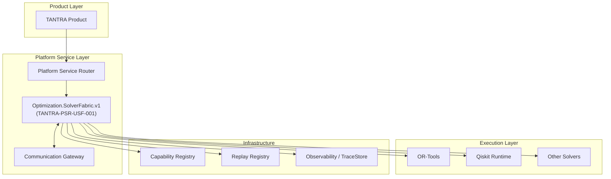

# ARCHITECTURE: Universal Solver Fabric

This document details the architectural boundaries of the Universal Solver Fabric, deployed as a **Constitutional Runtime Participant** (`Optimization.SolverFabric.v1`) within the TANTRA canonical ecosystem.

## 1. Architectural Philosophy

The core architectural tenet of the Universal Solver Fabric is the **strict decoupling of domain formulation from deterministic execution**. 
It acts as a governed participant and execution fabric rather than an orchestrator. It does not dictate optimization modeling, nor does it contain business logic.

## 2. Constitutional Position

The Solver Fabric occupies exactly **one constitutional position** in the BHIV Living Organism:

## 3. Component Breakdown

### Core Components
1. **Solver Capability Contract** (`solver_contract.schema.json`): Schema-driven contract governing solver capability declarations.
2. **Universal Solver Registry** (`solver_registry.py`): In-memory component to validate and track solver registration metadata.
3. **Solver Selection Engine** (`solver_selection_engine.py`): Deterministic ranking and selection of compatible solvers.
4. **Execution Adapter** (`execution_adapter.py`): Translates requests, executes deterministically, and produces replay-safe evidence.
5. **Solver Interfaces** (`solver_interfaces/`): Attachment points for different runtimes.

### Constitutional Integration Components
6. **Constitutional Runtime Contract** (`constitutional_runtime_contract.py`): Authority Matrix, Runtime/API/Event/Attachment Contracts, Version Negotiation, Failure Behaviour, Replay & Evidence Guarantees.
7. **Gateway Bridge** (`fabric_gateway_bridge.py`): Bridges solver results to the Communication Gateway pipeline.
8. **Quantum Runtime** (`fabric_quantum_runtime.py`): Live quantum execution with classical fallback.
9. **Registry Participant** (`fabric_registry_participant.py`): Five-registry deterministic registration.
10. **Observability** (`fabric_observability.py`): Complete trace/metric/evidence collection.

## 4. Position in the TANTRA Ecosystem

As defined by the BCAB/BCAES canonical model:

* **Primary Domain**: Sovereign Optimization
* **Layer**: Platform Service Layer / Agnostic Execution Layer
* **Allowed Consumers**: TANTRA Product Layer, Platform Services
* **Upstream Dependencies**: TANTRA Platform Service, Request Routing, GovernanceLayer
* **Downstream Dependencies**: Execution Engines, Communication Gateway, Observability

## 5. Authority Boundaries

### Owns
- Solver Capability Contract enforcement
- Deterministic Solver Selection
- Execution Adapter lifecycle
- Solver health tracking
- Evidence package generation
- Attachment mode negotiation (LOCAL/REMOTE/HYBRID)
- Solver Registry management

### Explicitly Does NOT Own
- Problem formulation / modeling
- Business logic execution
- Orchestration of external workflows
- Master Directive definitions
- Budget / cost approval
- Data storage / persistence
- Replay detection (→ CanonicalReplayAuthority)
- Governance policy (→ GovernanceLayer)
- Service registration (→ PlatformServiceRegistry)

## 6. Integration Points

| Participant                | Direction  | Protocol  | Purpose                              |
|----------------------------|------------|-----------|--------------------------------------|
| Capability Registry        | Outbound   | HTTP/REST | Capability registration & discovery  |
| Platform Service Registry  | Outbound   | In-process| Runtime registration & lifecycle     |
| Replay Registry            | Outbound   | In-process| Replay enforcement                   |
| Communication Gateway      | Bidirectional | In-process | Result routing & trust validation |
| Quantum Runtime (Qiskit)   | Outbound   | In-process| Quantum solver execution             |
| Observability / TraceStore | Outbound   | In-process| Trace & metric emission              |
| Heartbeat Manager          | Outbound   | In-process| Liveness heartbeats                  |

## 7. References

- [RUNTIME_IDENTITY_CARD.md](RUNTIME_IDENTITY_CARD.md) — Permanent constitutional identity
- [UNIVERSAL_SOLVER_FABRIC.md](UNIVERSAL_SOLVER_FABRIC.md) — Lifecycle diagrams and failure modes
- [runtime_flow.md](runtime_flow.md) — Canonical runtime execution path
- [PLATFORM_SERVICE_SPEC.md](PLATFORM_SERVICE_SPEC.md) — API specification
